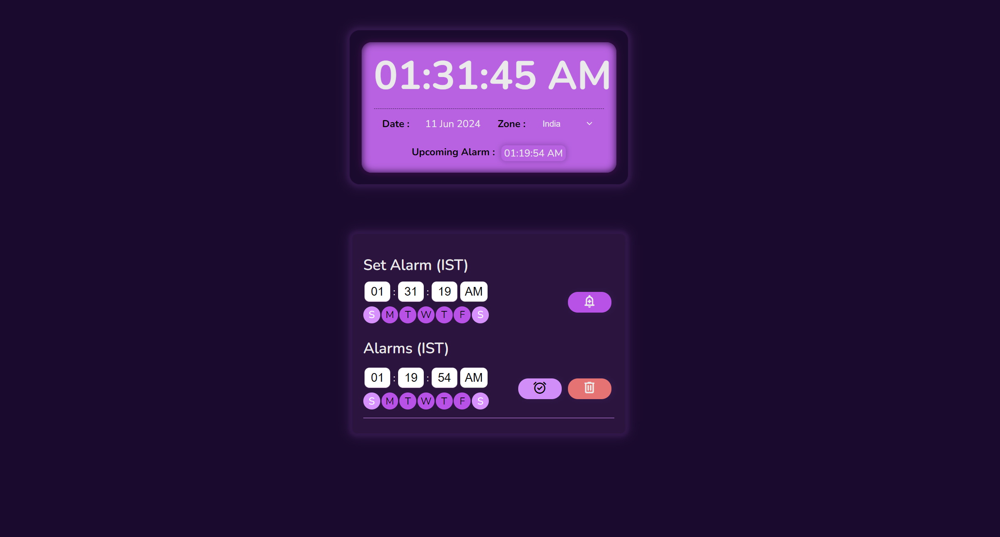

# WebClock

WebClock is a web-based application that displays the current time for multiple regions and allows users to set alarms. This application is designed to be simple, user-friendly, and highly customizable.

## Project Link

Visit the application: [WebClock](https://kumar-jit.github.io/WebClock/)

## Table of Contents
- [Features](#features)
- [Installation](#installation)
- [Usage](#usage)
- [Snapshot](#snapshot)

## Features
- Display current time for multiple regions.
- Set alarms with customizable days.
- Easy-to-use interface.

## Installation
To run the WebClock application locally, follow these steps:
1. **Clone the repository:**
    ```bash
    git clone https://github.com/kumar-jit/WebClock.git
    cd WebClock
    ```
2. **Open `index.html` in your web browser:**
    You can simply double-click the `index.html` file or open it using a web server.

## Usage
1. **View Time for Multiple Regions:**
    - The main page displays the current time for predefined regions.
    - You can customize the regions by editing the `regions` array in `script.js`.
2. **Set Alarms:**
    - Click on the "Set Alarm" button.
    - Click "Save" to set the alarm. You will be notified when the alarm goes off.

## Snapshot

